# Lease Management Application

## Overview

The Lease Management Application streamlines lease operations with a React frontend and Node.js backend. It offers comprehensive features for users to apply, manage payments, and track transactions securely. Administrators can efficiently oversee complaints, update statuses, and maintain housing options, ensuring a seamless leasing experience.

## Features

- **User Authentication and Authorization**: Secure login and role-based access control.
- **Apartment Application Management**: Facilitates the application process for apartments.
- **Apply for Lease**: Enables users to apply for lease agreements.
- **Different User Roles**: Supports various user roles with distinct permissions.
- **Find and Track Application Status**: Allows users to locate and monitor the status of their applications.
- **View Lease Information**: Provides users with access to information about their leases.
- **Raise Complaints**: Users can submit complaints regarding their lease or living conditions.
- **Lease Payment Management**: Helps users manage their lease payments efficiently.
- **Admin Complaint Management**: Admins can oversee and address user complaints.
- **Update Lease Status**: Admins have the authority to modify the status of leases.
- **Terminate Lease**: Admins can initiate the termination of lease agreements.
- **Add and Edit Housing Options**: Admins can add new housing options and modify existing ones.
- **Filter Houses**: Allows users to filter available housing options based on criteria such as the number of bedrooms and available date.
- **Transaction Tracking and History**: Tracks and maintains a history of all lease-related transactions.
- **Secure Payment Processing**: Ensures secure processing of lease payments.
- **User-Friendly Interface**: Offers an intuitive interface for easy navigation and usage.

## Technologies Used

- **Frontend:**
  - React
  - Material-UI

- **Backend:**
  - Node.js
  - Express
  - MongoDB

## Getting Started

### Prerequisites

Ensure you have the following installed:

- Node.js (v14 or later)
- MongoDB

### Installation

1. **Clone the repositories:**

    ```bash
    git clone https://github.com/Hrithik/house-rentals.git
    cd lease-management
    ```

2. **Install dependencies:**

    For the backend:

    ```bash
    npm install
    ```

    For the frontend:

    ```bash
    npm install
    ```

3. **Configure environment variables:**

    Create a `.env` file in the `backend` directory and add the following:

    ```env
    PORT=3001
    MONGO_URI=your_mongodb_connection_string
    JWT_SECRET=your_jwt_secret
    ```

### Running the Application

1. **Start the backend server:**

    ```bash
    cd backend
    npm start
    ```

    The backend server should now be running on `http://localhost:3001`.

2. **Start the frontend development server:**

    ```bash
    cd ../frontend
    npm start
    ```

    The frontend development server should now be running on `http://localhost:3000`.

## API Endpoints

### User Authentication

- `POST /api/users/register` - Register a new user
- `POST /api/users/login` - User login

### Payments

- `GET /api/payments/:userId` - Get all payments for a user
- `PUT /api/updatePayment/:id` - Update payment status and transaction ID

### Example

To update a payment:

```http
PUT /api/updatePayment/:id
Content-Type: application/json

{
  "status": "Paid",
  "transactionId": "TX1234"
}
```

Backend is available at https://github.com/srinivastherapati/LeaseManagement


## Screenshots

<div align="center">
    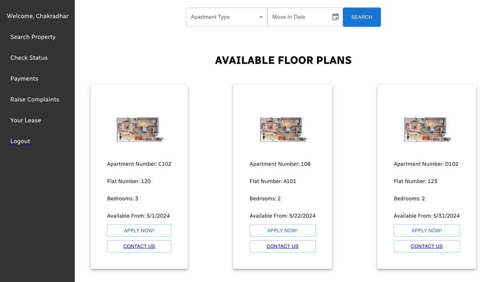 
</div>
<div align="center">
    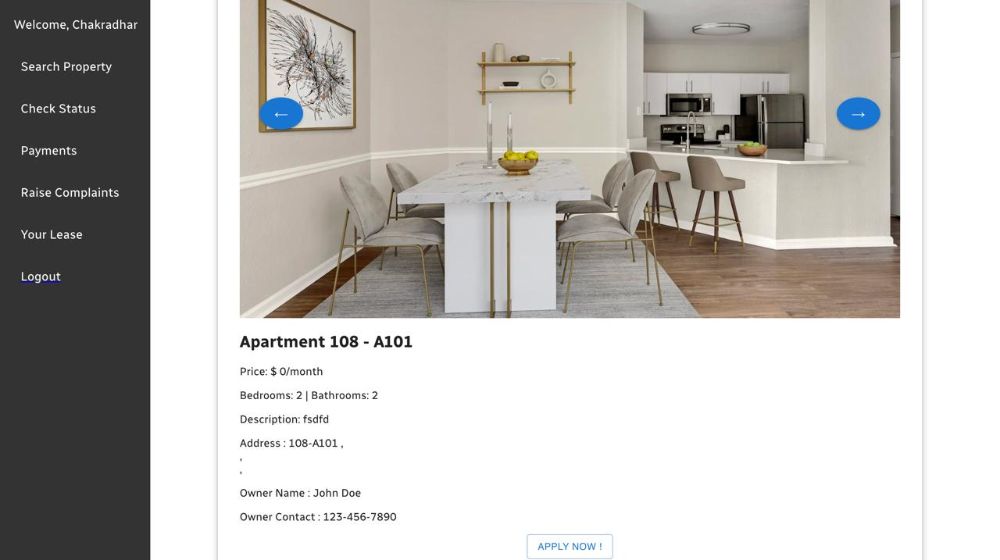 
</div>
<div align="center">
    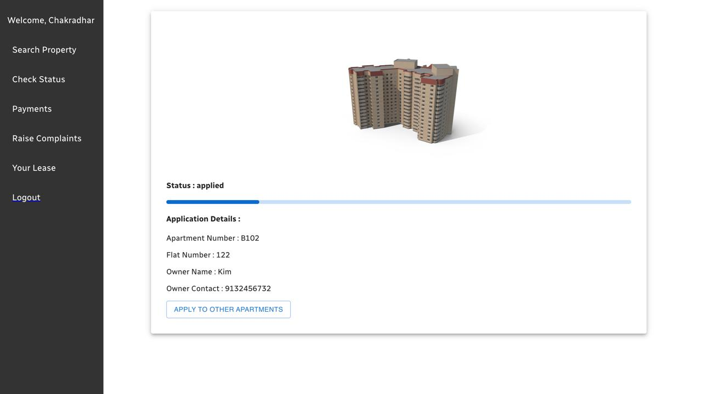 
</div>
<div align="center">
    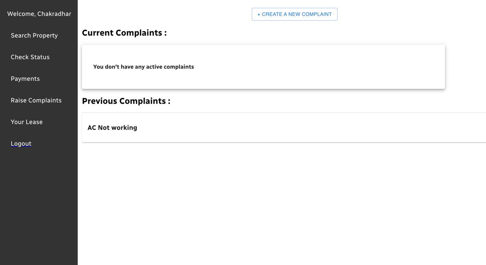 
</div>
<div align="center">
    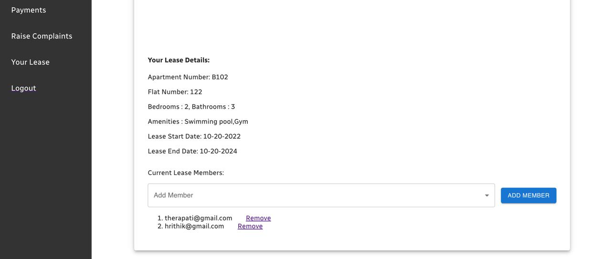 
</div>
<div align="center">
    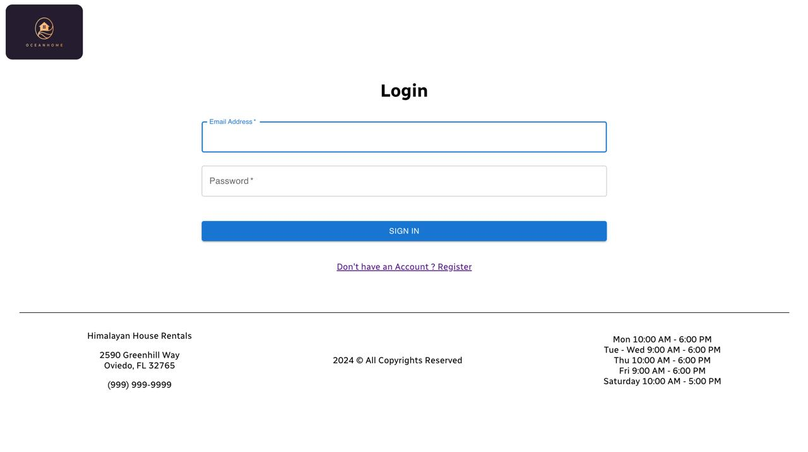 
</div>
<div align="center">
    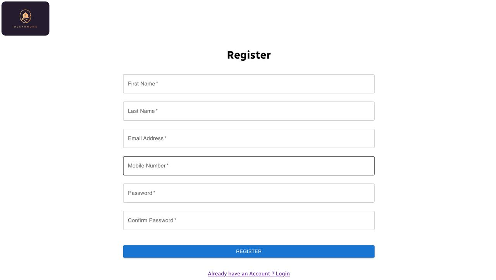 
</div>
<div align="center">
    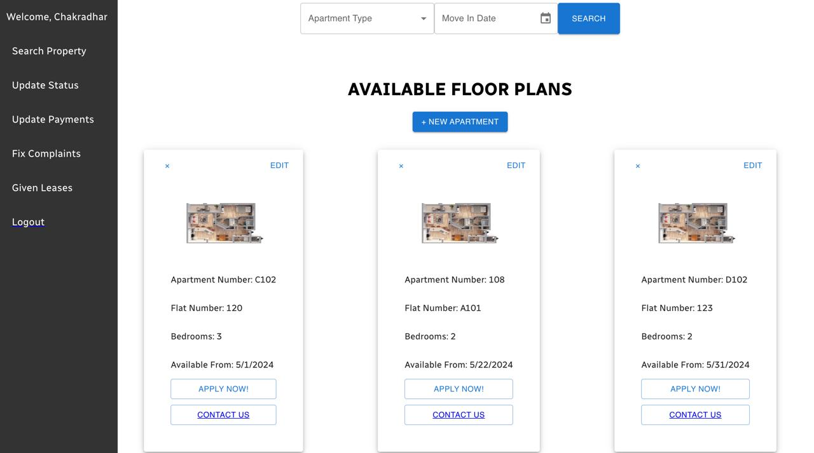 
</div>
<div align="center">
    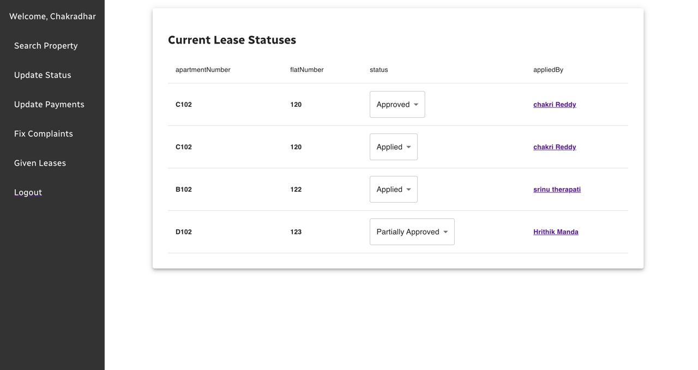 
</div>
<div align="center">
    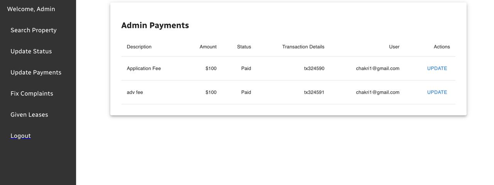 
</div>
<div align="center">
    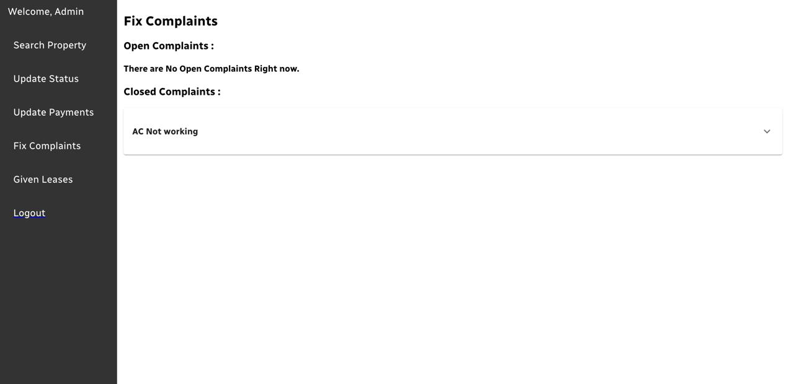 
</div>
<div align="center">
    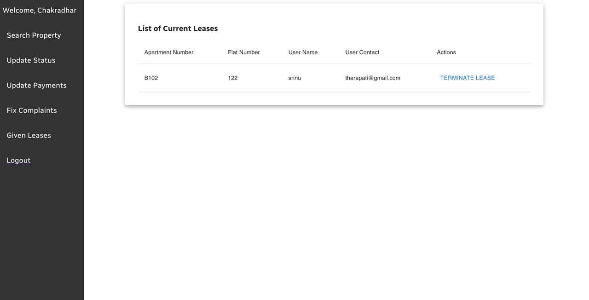 
</div>

## Contact
For any questions or suggestions, please contact
Hrithik Manda,
mandhahrithik@gmail.com
LinkedIn : https://www.linkedin.com/in/hrithik-manda/

